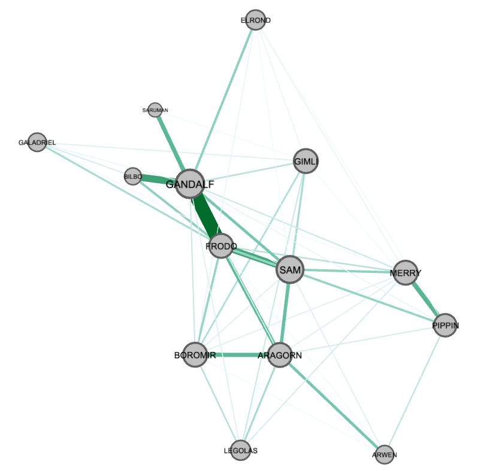

# movie_analysis
Movie analysis using Network Theory

## [Character Graph](character_graph)

It takes the script of a movie and generates a graph of the characters in the movie. The thicker the edges are, the more often the characters had a conversation.